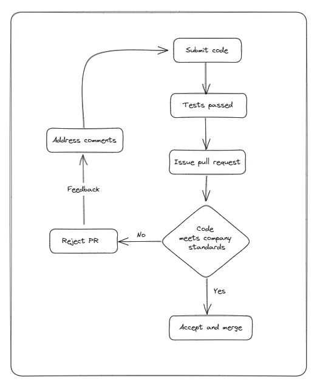

Code Review is the process of reading and assessing a piece of code to identify bugs, improve quality, and ensure compliance with established coding standards.

Code quality is important, especially if the code is part of a team project or is accessible to the public, such as in open-source development.

If every developer is allowed to code as they please, the codebase will eventually turn out to be a mess, as developers have different coding styles.

I am not saying that having different styles is a bad thing, but there has to be a common ground for all developers in a team, like a guide that they should follow.

That way, the codebase is more uniform, and it will be easier to find bugs and improve the quality.

## Benefits of Code Review

So what are the benefits of code review?

As I mentioned earlier, code review makes it easier to catch bugs that were missed during the development process.

Additionally, the reviewer can identify bad practices and suggest improvements that can lead to a more readable, performant, and maintainable codebase.

## The Code Review Process

Let’s talk about the processes involved in code review.

First, when a developer submits code, it must pass all tests set in place, such as unit tests and integration tests.

Once the code has passed all tests, the developer can issue a pull request, and a reviewer will assess the code.

If the code passes review, it can be merged into the main codebase.

If the code does not pass review, the reviewer can provide constructive feedback, and the developer will work on the code to address the issues raised in the comments provided by the reviewer.

This cycle continues until the code reaches a satisfactory point, at which it will be merged into the codebase.

## Tips for Successful Code Review

1. Keeping pull requests small is essential for efficient code review. Large pull requests make it challenging to identify problems and suggest better solutions. It’s best to split pull requests into smaller, more specific ones to improve the review process.
2. Reviewing code for more than an hour at a time can decrease performance and credibility. The brain needs rest to refresh, and a superficial review can lead to missed defects. It’s important to keep focus and conduct a thorough review.
3. Adding a clear description to a pull request can help reviewers better understand the problem and why a particular solution was chosen. Clear descriptions can also be helpful in the future when attempting to understand why certain code was added.
4. Using a Pull Request template can help create a standard format for pull requests and make the review process more efficient. Many tools provide templates that can be customized to meet the team’s needs.
5. There is no specific rule on the number of reviewers required to merge a pull request. The team should decide on an appropriate number based on the criticality of the feature being added or changed. Too many reviewers can create a bottleneck in the process.
6. Empathy is crucial during code reviews. Reviewers should try to understand the author’s thought process and be kind when commenting on pull requests. Questions should be asked to understand the implementation better, and positive feedback should be given where appropriate.
7. Delegating static analysis checks to automated tools can save time and allow the team to focus on more critical aspects of the code. Automatable static analysis checks, such as spaces and missing commas, should be delegated to the tools during the CD/CI process.
8. Running a retrospective after a month or two of reviews can help improve the code review process. An external facilitator should be used to conduct the retrospective, and feedback should be collected from the team to identify what worked and what didn’t.

## Common Code Review Tools

Codebrag

Codebrag is one of the best open source code review tools that are quite simple to use. It is mainly used to review inline comments and likes, smart email notifications, non-blocking codes, and more.

Gerrit

Gerrit is among the free and open source code review tools that help to review code on a web browser. It is a code review tool that is self-hosted and lightweight. With Gerrit, you can enable every committer involved in a project to keep track of all the changes.

Reviewable

Reviewable is one of the best open source code review tools in terms of functionality and appearance. It is among the open source secure code review tools that offer a clean and interactive UI that enables it to perform advanced functionality easily. For example, you can perform actions like comparing the differences between any two file revisions or installing customizable logic that lets you know if the code review is complete.

ReviewBoard

ReviewBoard is among the simple yet powerful free code review tools that make the entire review process meticulous. In addition, it provides functionalities like differences and the ability to make comments.

Phabricator Differential (Open Source)

Phabricator Differential is among the source code review tools free that lets you download and install it on your hardware or launch a hosted instance with them. It is considered the best code review tool amongst the top open source code review tools.

Rhodecode

Rhodecode is a popular open-source code review tool that makes it easy to handle code management. It is a well-protected enterprise source code management system that is an integrated tool for Mercurial, Git, and Subversion.

CodeStriker

CodeStriker is among the top open source code review tools. It supports reviews of formal documents and differences generated by SCM and plain unified patches. In addition, there is a plug-in architecture for issues-tracking systems.

SmartBear

SmartBear has automated software, Collaborator, to instantly help you with your code quality. In addition, it supports most version control systems like Subversion, CVS, TFS, Perforce, and Git.

## Conclusion

If you are involved in software development, I highly recommend implementing a code review process. It can help improve the quality of your codebase, catch bugs that were missed during development, and ensure that coding standards are followed. Additionally, it can provide an opportunity for team members to learn from each other and improve their coding skills. Remember to keep pull requests small, provide clear descriptions, be empathetic during reviews, and delegate static analysis checks to automated tools. Use the tools mentioned above or find others that fit your team’s needs. Finally, conduct retrospectives to continuously improve your code review process.

### Resources

[https://www.softwaresuggest.com/blog/free-open-source-code-review-tools](https://www.softwaresuggest.com/blog/free-open-source-code-review-tools)
